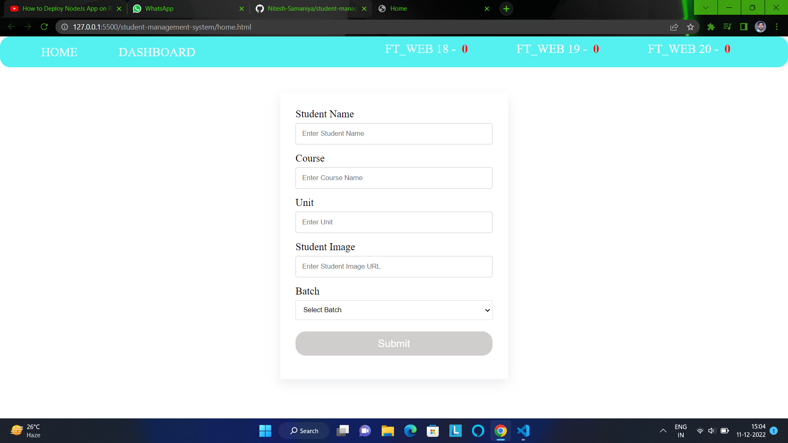
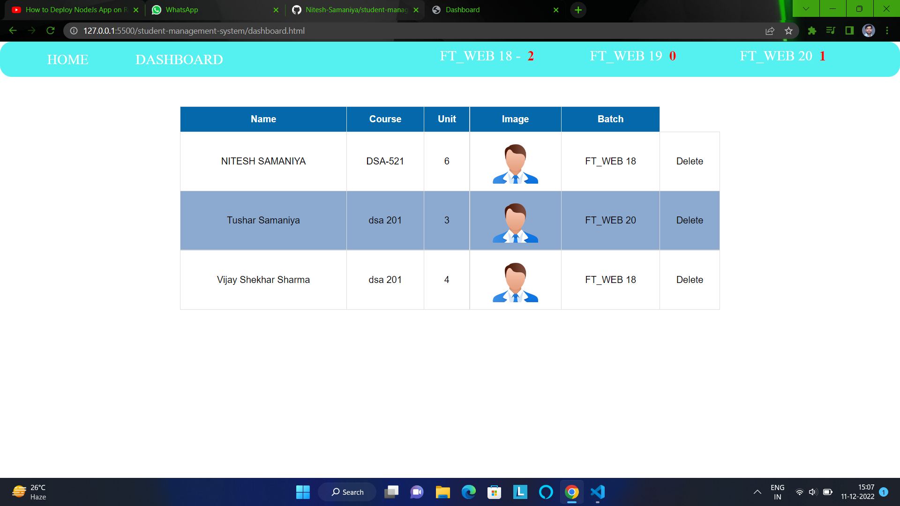

# student-management-system

`User can add a student in local database accordingly batch wise and later see the student list on dashboard page where user can also see no. of count per batch student added into list.`

;
